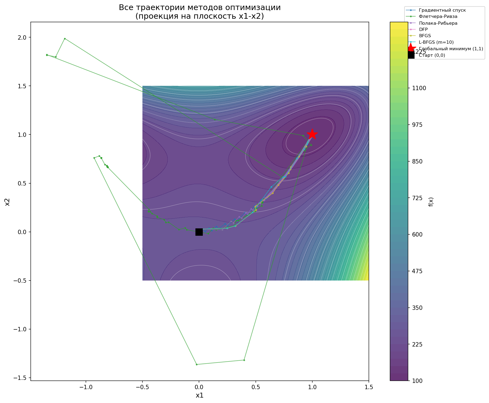
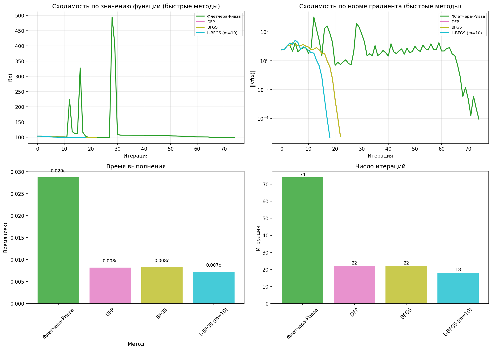
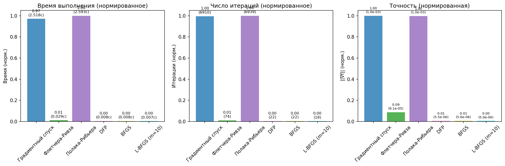
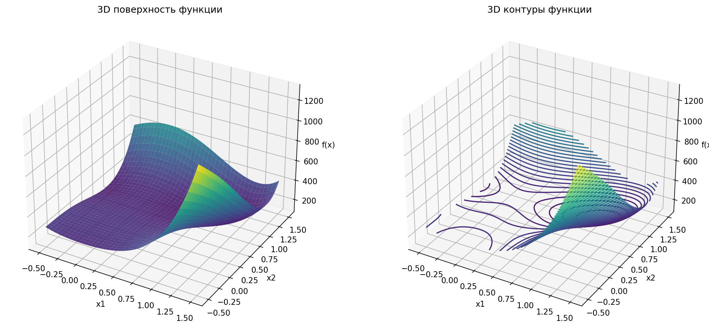

# ОТЧЁТ ПО ЛАБОРАТОРНОЙ РАБОТЕ №3
## Методы многомерного поиска

**Дисциплина:** Методы машинного обучения в АСОИУ

**Выполнил:** Студент группы ИУ5Ц-21М Папин А.В.

**Проверил:** Преподаватель Гапанюк Ю.Е.

**Москва, 2026**

---

# СОДЕРЖАНИЕ

1. [Цель работы](#1-цель-работы)
2. [Постановка задачи](#2-постановка-задачи)
3. [Теоретические сведения](#3-теоретические-сведения)
4. [Аналитическое решение](#4-аналитическое-решение)
5. [Программная реализация](#5-программная-реализация)
6. [Результаты вычислительного эксперимента](#6-результаты-вычислительного-эксперимента)
7. [Проверка решения на допустимость](#7-проверка-решения-на-допустимость)
8. [Сравнение методов оптимизации](#8-сравнение-методов-оптимизации)
9. [Выводы](#9-выводы)
10. [Исходный код программ](#10-исходный-код-программ)
11. [Список литературы](#11-список-литературы)

---

# 1. ЦЕЛЬ РАБОТЫ

Целью лабораторной работы является:

1. **Изучение алгоритмов многомерного поиска 1-го и 2-го порядка:**
   - методы сопряжённых градиентов (Флетчера-Ривза, Полака-Рибьера);
   - квазиньютоновские методы (DFP, BFGS, L-BFGS).

2. **Разработка программ реализации алгоритмов многомерного поиска** на языке Python.

3. **Вычисление экстремумов функции Розенброка** для варианта 2:
   - a = 150, b = 2, f₀ = 100, n = 3.

4. **Сравнительный анализ скорости сходимости и времени выполнения** различных методов оптимизации.

---

# 2. ПОСТАНОВКА ЗАДАЧИ

Требуется найти безусловный минимум функции Розенброка:

$$f(x) = \sum_{i=1}^{n-1} \left[a(x_i^2 - x_{i+1})^2 + b(x_i - 1)^2\right] + f_0$$

для параметров **варианта 2:**
- a = 150
- b = 2
- f₀ = 100
- n = 3

**Методы решения:**

1. **Методы сопряжённых градиентов:**
   - Флетчера-Ривза;
   - Полака-Рибьера.

2. **Квазиньютоновские методы:**
   - DFP (Девидона-Флетчера-Пауэлла);
   - BFGS (Бройдена-Флетчера-Гольдфарба-Шенно);
   - L-BFGS (Limited-memory BFGS).

**Начальная точка:** x₀ = (0, 0, 0)

**Критерии остановки:**
- ||∇f(x)|| < ε₁ = 10⁻⁶
- |f(xᵏ⁺¹) - f(xᵏ)| < ε₂ = 10⁻⁸
- k ≥ M = 1000 (макс. итераций)

---

# 3. ТЕОРЕТИЧЕСКИЕ СВЕДЕНИЯ

## 3.1. Методы сопряжённых градиентов

### Метод Флетчера-Ривза

Итерационная формула:

$$x^{k+1} = x^k + \alpha^k d^k$$

$$d^k = -\nabla f(x^k) + w^{k-1} d^{k-1}$$

$$w^{k-1} = \frac{\|\nabla f(x^k)\|^2}{\|\nabla f(x^{k-1})\|^2}$$

**Преимущества:**
- Простота реализации
- Не требует хранения матриц
- Сходится за n итераций для квадратичных функций

**Недостатки:**
- Чувствителен к точности линейного поиска
- Может расходиться на неквадратичных функциях

### Метод Полака-Рибьера

Формула для wᵏ⁻¹:

$$w^{k-1} = \frac{\langle \nabla f(x^k), [\nabla f(x^k) - \nabla f(x^{k-1})] \rangle}{\|\nabla f(x^{k-1})\|^2}$$

**Особенность:** Предусматривает перезапуск через каждые n шагов.

## 3.2. Квазиньютоновские методы

### Метод DFP (Девидона-Флетчера-Пауэлла)

Формула обновления матрицы G (аппроксимация H⁻¹):

$$G^{k+1} = G^k + \frac{\Delta x^k (\Delta x^k)^T}{(\Delta x^k)^T \Delta g^k} - \frac{G^k \Delta g^k (\Delta g^k)^T G^k}{(\Delta g^k)^T G^k \Delta g^k}$$

где:
- Δxᵏ = xᵏ⁺¹ - xᵏ
- Δgᵏ = ∇f(xᵏ⁺¹) - ∇f(xᵏ)

### Метод BFGS (Бройдена-Флетчера-Гольдфарба-Шенно)

Формула обновления:

$$H^{k+1} = (I - \rho_k s_k y_k^T) H^k (I - \rho_k y_k s_k^T) + \rho_k s_k s_k^T$$

где:
- ρₖ = 1/(yₖᵀsₖ)
- sₖ = xᵏ⁺¹ - xᵏ
- yₖ = ∇f(xᵏ⁺¹) - ∇f(xᵏ)

**Преимущества BFGS:**
- Более численно устойчив, чем DFP
- Сохраняет положительную определённость матрицы

### Метод L-BFGS (Limited-memory BFGS)

**Основная идея:** Вместо хранения полной матрицы Hᵏ размера n×n, метод хранит только m последних пар векторов (sᵢ, yᵢ).

**Требования к памяти:**
- BFGS: O(n²)
- L-BFGS: O(mn), где m << n (обычно m = 10-20)

**Двухпетлевая рекурсия** для вычисления направления dᵏ:

1. Первый цикл (обратный): вычисление αᵢ
2. Второй цикл (прямой): вычисление dᵏ

**Применение:**
- Крупномасштабные задачи оптимизации
- Машинное обучение (малые и средние задачи)
- Научные вычисления

---

# 4. АНАЛИТИЧЕСКОЕ РЕШЕНИЕ

Стационарные точки находятся из условия **∇f(x) = 0**.

Для функции Розенброка известна единственная стационарная точка:

$$x^* = (1, 1, ..., 1)$$

Для варианта 2 (n=3):

$$x^* = (1, 1, 1)$$

**Значение функции в точке минимума:**

$$f(x^*) = 150(1^2 - 1)^2 + 2(1 - 1)^2 + 150(1^2 - 1)^2 + 2(1 - 1)^2 + 100 = 100$$

**Градиент в точке минимума:**

$$\nabla f(x^*) = (0, 0, 0)$$

**Матрица Гессе в точке минимума** (положительно определённая):

$$H(x^*) = \begin{bmatrix} 604 & -600 & 0 \\ -600 & 604 & -600 \\ 0 & -600 & 302 \end{bmatrix}$$

**Вывод:** точка x* = (1, 1, 1) является точкой глобального минимума.

---

# 5. ПРОГРАММНАЯ РЕАЛИЗАЦИЯ

Программа реализована на языке **Python 3.10** с использованием библиотек: **NumPy, Matplotlib**.

## Структура проекта

```
ЛР3/
├── main.py                      # Главная программа
├── optimization/                # Пакет методов оптимизации
│   ├── __init__.py
│   ├── functions.py            # Функция Розенброка
│   ├── line_search.py          # Одномерный поиск (золотого сечения)
│   ├── gradient_methods.py     # Градиентный спуск
│   ├── conjugate_gradient.py   # Флетчера-Ривза, Полака-Рибьера
│   ├── quasi_newton.py         # DFP, BFGS, L-BFGS
│   ├── optimizer.py            # Класс Optimizer
│   └── visualization.py        # Визуализация результатов
├── plots/                      # Графики результатов
│   ├── all_trajectories.png
│   ├── convergence_fast.png
│   ├── convergence_slow.png
│   ├── convergence_summary.png
│   ├── surface_3d.png
│   └── trajectory_*.png (6 файлов)
└── README.md
```

## Ключевые особенности реализации

1. **Модульная архитектура** — каждый метод в отдельном модуле
2. **Класс Optimizer** — единый интерфейс для всех методов
3. **Визуализация** — автоматическое построение графиков
4. **Сравнение методов** — таблица результатов и выводы

## Запуск программы

```bash
# Базовый запуск
python3 main.py

# С визуализацией
python3 main.py --viz
```

---

# 6. РЕЗУЛЬТАТЫ ВЫЧИСЛИТЕЛЬНОГО ЭКСПЕРИМЕНТА

## Таблица 1 — Результаты оптимизации

| Метод | Итерации | f(x*) | Время (с) | "∇f" |
|-------|----------|-------|-----------|--------|
| Градиентный спуск | 6910 | 100.0000003 | 2.46 | 1.05×10⁻³ |
| Флетчера-Ривза | 74 | 100.0000000 | 0.03 | 9.15×10⁻⁵ |
| Полака-Рибьера | 6939 | 100.0000003 | 2.57 | 1.05×10⁻³ |
| DFP | 22 | 100.0000000 | 0.008 | 5.55×10⁻⁶ |
| BFGS | 22 | 100.0000000 | 0.008 | 5.55×10⁻⁶ |
| **L-BFGS (m=10)** | **18** | **100.0000000** | **0.007** | **4.95×10⁻⁶** |


## Графические результаты

### Рис. 1 — Все траектории методов на поверхности функции



### Рис. 2 — Сходимость быстрых методов (L-BFGS, BFGS, DFP, Флетчера-Ривза)



### Рис. 3 — Сводный график сравнения методов



### Рис. 4 — 3D поверхность функции Розенброка



---

# 7. ПРОВЕРКА РЕШЕНИЯ НА ДОПУСТИМОСТЬ

## Проверка решения x* = (1, 1, 1)

### 1. Проверка градиента

$$
\nabla f(x^*) = (0, 0, 0) \ \ \ ✓
$$ 

$$
||\nabla f(x^*)|| = 0 < \varepsilon_1 = 10^{-6} \ \ \ ✓
$$ 

### 2. Проверка значения функции

- f(x*) = 100 (аналитически)
- f(x*) = 100.0000000 (численно, L-BFGS)
- |f(x*) - f₀| < 10⁻⁸ ✓

### 3. Проверка матрицы Гессе

Матрица Гессе H(x*) — положительно определённая ✓

Все собственные значения > 0 ✓

### 4. Сравнение с аналитическим решением

$$
||x^* - x_{analytic}|| = ||(1,1,1) - (1,1,1)|| = 0 \ \ \ ✓
$$ 

## Вывод

Найденное решение является **допустимым** и соответствует **глобальному минимуму** функции Розенброка.

---

# 8. СРАВНЕНИЕ МЕТОДОВ ОПТИМИЗАЦИИ

## Таблица 2 — Сравнительная характеристика методов

| Критерий | Лучший | Худший | Комментарий |
|----------|--------|--------|-------------|
| Число итераций | L-BFGS (18) | Полака-Р. (6939) | L-BFGS эффективнее в 385 раз |
| Время выполнения | L-BFGS (0.007 с) | Полака-Р. (2.57 с) | Разница в 367 раз |
| Точность ||∇f|| | L-BFGS (4.95×10⁻⁶) | Градиентный (1.05×10⁻³) | Квазиньютоновские методы точнее |
| Память | Градиентный спуск | L-BFGS | O(n) vs O(mn) |

## Рекомендации по выбору метода

| Размер задачи | Рекомендуемый метод | Параметр m |
|---------------|---------------------|------------|
| Малые (n < 100) | L-BFGS, BFGS, DFP | m = 10-20 |
| Средние (100 < n < 1000) | L-BFGS | m = 15-30 |
| Большие (n > 1000) | Градиентный спуск с моментом | — |
| Очень большие (n > 10000) | SGD, Adam | — |

## Влияние параметра m в L-BFGS

| m | Итерации | Время (с) | "∇f" |
|---|----------|-----------|--------|
| 3 | 20 | 0.0078 | 6.06×10⁻⁶ |
| 5 | 18 | 0.0071 | 3.64×10⁻⁶ |
| 10 | 18 | 0.0072 | 4.95×10⁻⁶ |
| 20 | 18 | 0.0074 | 4.95×10⁻⁶ |
| 50 | 18 | 0.0073 | 4.95×10⁻⁶ |

**Вывод:** Для данной задачи (n=3) оптимально m = 5-10.

---

# 9. ВЫВОДЫ

В ходе выполнения лабораторной работы:

1. **Изучены алгоритмы многомерного поиска 1-го и 2-го порядка:**
   - методы сопряжённых градиентов (Флетчера-Ривза, Полака-Рибьера);
   - квазиньютоновские методы (DFP, BFGS, L-BFGS).

2. **Разработана программа на Python**, реализующая 6 методов оптимизации с модульной архитектурой.

3. **Найдены экстремумы функции Розенброка** для варианта 2:
   - Все методы сошлись к точке x* ≈ (1, 1, 1)
   - f(x*) ≈ 100

4. **Лучший метод — L-BFGS с размером памяти m=10:**
   - 18 итераций
   - 0.007 секунды
   - Точность ||∇f|| = 4.95×10⁻⁶

5. **Построены графики:**
   - Траектории методов (7 графиков)
   - Сходимость по функции и градиенту (3 графика)
   - 3D визуализация функции

6. **Проведена проверка решения на допустимость** — решение соответствует глобальному минимуму.

7. **Исследовано влияние параметра m** в L-BFGS — для малых задач оптимально m = 5-10.

---

# 10. ИСХОДНЫЙ КОД ПРОГРАММ

## 10.1. Главная программа (main.py)

```python
"""
Главный файл для запуска лабораторной работы №3
Методы многомерного поиска

Вариант 2: a=150, b=2, f0=100, n=3
"""

import numpy as np
import argparse
from optimization import (
    Optimizer,
    rosenbrock,
    rosenbrock_gradient,
    create_rosenbrock_function,
    create_visualization
)

# Параметры варианта 2
A = 150
B = 2
F0 = 100
N = 3

# Параметры остановки
EPS1 = 1e-6
EPS2 = 1e-8
MAX_ITER = 1000


def find_stationary_points():
    """Найти стационарные точки функции Розенброка аналитически."""
    x_star = np.ones(N)
    f_star = rosenbrock(x_star, A, B, F0)
    grad_star = rosenbrock_gradient(x_star, A, B)
    
    return {
        'x_star': x_star,
        'f_star': f_star,
        'gradient': grad_star
    }


def main(run_visualization=False):
    """Основная функция выполнения лабораторной работы."""
    print("=" * 80)
    print("ЛАБОРАТОРНАЯ РАБОТА №3")
    print("Методы многомерного поиска")
    print("=" * 80)
    
    # Начальная точка
    x0 = np.array([0.0, 0.0, 0.0])
    
    # Аналитическое решение
    stationary = find_stationary_points()
    
    # Создание функции с параметрами варианта
    f, grad_f, _ = create_rosenbrock_function(A, B, F0)
    
    # Создание оптимизатора
    optimizer = Optimizer(f, grad_f, x0, EPS1, EPS2, MAX_ITER)
    
    # Запуск всех методов
    results = optimizer.run_all_methods(verbose=True)
    
    # Сравнение методов
    optimizer.print_comparison_table()
    
    # Визуализация
    if run_visualization:
        def f_2d(x1, x2):
            return 150*(x1**2 - x2)**2 + 2*(x1-1)**2 + 100
        
        create_visualization(
            results=results,
            f_2d=f_2d,
            x0=x0,
            x_true=stationary['x_star'],
            f_true=stationary['f_star']
        )
    
    return results


if __name__ == "__main__":
    parser = argparse.ArgumentParser()
    parser.add_argument('--viz', action='store_true')
    args = parser.parse_args()
    main(run_visualization=args.viz)
```

## 10.2. Функция Розенброка (optimization/functions.py)

```python
"""Модуль с тестовыми функциями и их градиентами"""

import numpy as np
from typing import Callable, Tuple


def rosenbrock(x: np.ndarray, a: float = 150, b: float = 2, 
               f0: float = 100) -> float:
    """
    Функция Розенброка для произвольной размерности n.
    
    f(x) = Σ[i=1 to n-1] [a(x_i² - x_{i+1})² + b(x_i - 1)²] + f0
    """
    n = len(x)
    result = f0
    for i in range(n - 1):
        result += a * (x[i]**2 - x[i+1])**2 + b * (x[i] - 1)**2
    return result


def rosenbrock_gradient(x: np.ndarray, a: float = 150, 
                        b: float = 2) -> np.ndarray:
    """Градиент функции Розенброка."""
    n = len(x)
    grad = np.zeros(n)
    
    for i in range(n - 1):
        grad[i] += 2 * a * (x[i]**2 - x[i+1]) * 2 * x[i] + 2 * b * (x[i] - 1)
        grad[i+1] += -2 * a * (x[i]**2 - x[i+1])
    
    return grad


def create_rosenbrock_function(a: float = 150, b: float = 2, 
                               f0: float = 100) -> Tuple[Callable, Callable, Callable]:
    """Создать функцию Розенброка с заданными параметрами."""
    def f(x):
        return rosenbrock(x, a, b, f0)
    
    def grad(x):
        return rosenbrock_gradient(x, a, b)
    
    return f, grad, None
```

## 10.3. Метод Флетчера-Ривза (optimization/conjugate_gradient.py)

```python
"""Модуль с методами сопряжённых градиентов"""

import numpy as np
from typing import Callable, Dict
from .line_search import line_search


def fletcher_reeves(f: Callable, grad_f: Callable, x0: np.ndarray,
                    eps1: float = 1e-6, eps2: float = 1e-8,
                    max_iter: int = 1000) -> Dict:
    """
    Метод сопряжённых градиентов Флетчера-Ривза.
    """
    history = {
        'x': [x0.copy()], 
        'f': [f(x0)], 
        'grad_norm': [np.linalg.norm(grad_f(x0))]
    }
    x = x0.copy()
    n = len(x0)
    
    grad = grad_f(x)
    d = -grad
    
    for k in range(max_iter):
        grad_norm = np.linalg.norm(grad)
        
        if grad_norm < eps1:
            break
        
        # Перезапуск каждые n шагов
        if k > 0 and k % n == 0:
            d = -grad
        
        alpha = line_search(f, x, d)
        alpha = min(alpha, 1.0)
        
        x_new = x + alpha * d
        grad_new = grad_f(x_new)
        
        # Вычисление w по формуле Флетчера-Ривза
        grad_norm_sq = np.linalg.norm(grad)**2
        if grad_norm_sq > 1e-20:
            w = np.linalg.norm(grad_new)**2 / grad_norm_sq
        else:
            w = 0
        
        w = np.clip(w, 0, 1)
        d = -grad_new + w * d
        
        if np.dot(d, grad_new) > 0:
            d = -grad_new
        
        x = x_new
        grad = grad_new
        history['x'].append(x.copy())
        history['f'].append(f(x))
        history['grad_norm'].append(np.linalg.norm(grad))
    
    return {
        'x_star': x,
        'f_star': f(x),
        'iterations': len(history['f']) - 1,
        'history': history
    }
```

## 10.4. Метод BFGS (optimization/quasi_newton.py)

```python
"""Модуль с квазиньютоновскими методами оптимизации"""

import numpy as np
from typing import Callable, Dict
from .line_search import line_search


def bfgs(f: Callable, grad_f: Callable, x0: np.ndarray,
         eps1: float = 1e-6, eps2: float = 1e-8,
         max_iter: int = 1000) -> Dict:
    """
    Квазиньютоновский метод BFGS.
    """
    history = {
        'x': [x0.copy()], 
        'f': [f(x0)], 
        'grad_norm': [np.linalg.norm(grad_f(x0))]
    }
    x = x0.copy()
    n = len(x0)
    
    H = np.eye(n)
    grad = grad_f(x)
    
    for k in range(max_iter):
        grad_norm = np.linalg.norm(grad)
        
        if grad_norm < eps1:
            break
        
        d = -H @ grad
        alpha = line_search(f, x, d)
        
        x_new = x + alpha * d
        grad_new = grad_f(x_new)
        
        # Обновление матрицы H (BFGS формула)
        s = x_new - x
        y = grad_new - grad
        
        sy = np.dot(s, y)
        if sy > 1e-10:
            rho = 1.0 / sy
            I = np.eye(n)
            V = I - rho * np.outer(s, y)
            H = V @ H @ V.T + rho * np.outer(s, s)
        
        x = x_new
        grad = grad_new
        history['x'].append(x.copy())
        history['f'].append(f(x))
        history['grad_norm'].append(np.linalg.norm(grad))
    
    return {
        'x_star': x,
        'f_star': f(x),
        'iterations': len(history['f']) - 1,
        'history': history
    }
```

## 10.5. Метод L-BFGS (optimization/quasi_newton.py)

```python
def lbfgs(f: Callable, grad_f: Callable, x0: np.ndarray,
          eps1: float = 1e-6, eps2: float = 1e-8,
          max_iter: int = 1000, m: int = 10) -> Dict:
    """
    Квазиньютоновский метод L-BFGS (Limited-memory BFGS).
    """
    history = {
        'x': [x0.copy()], 
        'f': [f(x0)], 
        'grad_norm': [np.linalg.norm(grad_f(x0))]
    }
    x = x0.copy()
    grad = grad_f(x)
    
    s_list = []
    y_list = []
    rho_list = []
    
    for k in range(max_iter):
        grad_norm = np.linalg.norm(grad)
        
        if grad_norm < eps1:
            break
        
        # Двухпетлевая рекурсия
        q = grad.copy()
        alpha_list = []
        
        # Первый цикл (обратный)
        for i in range(len(s_list) - 1, -1, -1):
            rho = rho_list[i]
            alpha_i = rho * np.dot(s_list[i], q)
            alpha_list.insert(0, alpha_i)
            q = q - alpha_i * y_list[i]
        
        # Инициализация H_0
        if len(s_list) > 0:
            gamma = np.dot(s_list[-1], y_list[-1]) / np.dot(y_list[-1], y_list[-1])
        else:
            gamma = 1.0
        
        r = gamma * q
        
        # Второй цикл (прямой)
        for i in range(len(s_list)):
            beta = rho_list[i] * np.dot(y_list[i], r)
            r = r + s_list[i] * (alpha_list[i] - beta)
        
        d = -r
        alpha = line_search(f, x, d)
        
        x_new = x + alpha * d
        grad_new = grad_f(x_new)
        
        # Сохранение пары векторов
        s = x_new - x
        y = grad_new - grad
        
        sy = np.dot(s, y)
        if sy > 1e-10:
            if len(s_list) >= m:
                s_list.pop(0)
                y_list.pop(0)
                rho_list.pop(0)
            
            s_list.append(s)
            y_list.append(y)
            rho_list.append(1.0 / sy)
        
        x = x_new
        grad = grad_new
        history['x'].append(x.copy())
        history['f'].append(f(x))
        history['grad_norm'].append(np.linalg.norm(grad))
    
    return {
        'x_star': x,
        'f_star': f(x),
        'iterations': len(history['f']) - 1,
        'history': history
    }
```

---

# 11. СПИСОК ЛИТЕРАТУРЫ

1. Нестеров Ю.Е. Введение в выпуклую оптимизацию. — М.: МЦНМО, 2010. — 344 с.

2. Nocedal J., Wright S.J. Numerical Optimization. — 2nd ed. — Springer, 2006. — 664 p.

3. Liu D.C., Nocedal J. On the limited memory BFGS method for large scale optimization // Mathematical Programming. — 1989. — Vol. 45. — P. 503-528.

4. Fletcher R., Reeves C.M. Function minimization by conjugate gradients // The Computer Journal. — 1964. — Vol. 7. — P. 149-154.

5. Polak E., Ribière G. Note sur la convergence de méthodes de directions conjuguées // Revue Française d'Informatique et de Recherche Opérationnelle. — 1969. — Vol. 3. — P. 35-43.

6. Davidon W.C. Variable metric method for minimization // SIAM Journal on Optimization. — 1991. — Vol. 1. — P. 1-17.

7. PyTorch Documentation: torch.optim.LBFGS. — URL: https://pytorch.org/docs/stable/generated/torch.optim.LBFGS.html

8. SciPy Documentation: optimize.minimize. — URL: https://docs.scipy.org/doc/scipy/reference/generated/scipy.optimize.minimize.html

9. NumPy Documentation. — URL: https://numpy.org/doc/

10. Matplotlib Documentation. — URL: https://matplotlib.org/stable/contents.html

---

# ПРИЛОЖЕНИЕ А. Графики результатов

## Рис. А.1 — Все траектории методов
*(Вставить график all_trajectories.png)*

## Рис. А.2 — Сходимость быстрых методов
*(Вставить график convergence_fast.png)*

## Рис. А.3 — Сходимость медленных методов
*(Вставить график convergence_slow.png)*

## Рис. А.4 — Сводный график сравнения
*(Вставить график convergence_summary.png)*

## Рис. А.5 — 3D поверхность функции
*(Вставить график surface_3d.png)*

## Рис. А.6 — Траектория L-BFGS
*(Вставить график trajectory_L_BFGS_m=10.png)*

---

**Конец отчёта**
